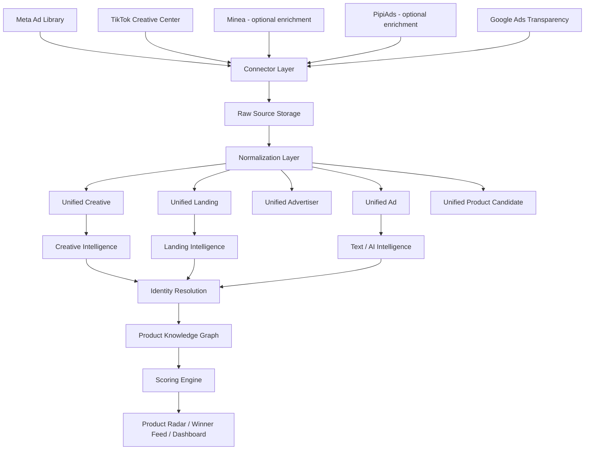

# AD & PRODUCT INTELLIGENCE PLATFORM
## Bản thiết kế tổng hợp – Multi-source Ads Collector + Product Intelligence

> Mục tiêu: xây một hệ thống nội bộ có thể **tự thu thập dữ liệu quảng cáo**, lưu lịch sử, phân tích creative, landing page, gom thành product cluster, chấm điểm sản phẩm và kết hợp dữ liệu nội bộ của công ty để tìm sản phẩm tiềm năng.
>
> Nguyên tắc cốt lõi: **không phụ thuộc vào Minea/PipiAds làm nguồn sống còn**. Meta/TikTok/public ad surfaces + crawler riêng là nguồn dữ liệu chính; Minea/PipiAds và các tool thương mại khác chỉ nên là nguồn enrichment nếu có API/export/quyền truy cập phù hợp.

---

# 1. MỤC TIÊU SẢN PHẨM

App không chỉ là “Ads Library clone”.

Nó phải trả lời được các câu hỏi:

- Sản phẩm nào đang bắt đầu có sóng?
- Có bao nhiêu advertiser/page đang chạy cùng một sản phẩm?
- Có bao nhiêu creative khác nhau nhưng thực chất cùng một video?
- Creative nào đang bị copy nhiều?
- Landing page nào đang được clone nhiều?
- Sản phẩm nào phù hợp riêng với Saudi / UAE / Kuwait / Qatar / US...?
- Sản phẩm nào có tín hiệu tốt ngoài thị trường nhưng không phù hợp với công ty?
- Sản phẩm nào từng test rồi và performance nội bộ ra sao?
- Video nào, hook nào, landing nào, offer nào đang có dấu hiệu “winner”?
- Một product trend đang tăng thật hay chỉ là dữ liệu trùng lặp giữa nhiều nguồn?

---

# 2. NGUYÊN TẮC KIẾN TRÚC

## 2.1. Không lấy `ad_id` làm trung tâm

Đối tượng trung tâm phải là:

```text
PRODUCT
├── Ads
├── Advertisers
├── Creative Families
├── Landing Families
├── Markets
├── Offers
├── Price History
├── Trend History
└── Internal Sales Data
```

Một sản phẩm có thể xuất hiện dưới hàng chục hoặc hàng trăm ad khác nhau.

## 2.2. Mỗi nền tảng chỉ là một nguồn dữ liệu

```text
Meta
TikTok
Minea
PipiAds
Google
Other Sources
        ↓
  Connector Layer
        ↓
   Unified Schema
        ↓
 Product Intelligence
```

Không được để business logic phụ thuộc trực tiếp vào cấu trúc riêng của từng website.

## 2.3. Raw data luôn phải được giữ lại

Không chỉ lưu dữ liệu đã normalize.

```text
raw_source_records
├── id
├── source
├── source_record_id
├── payload JSONB
├── fetched_at
├── collector_version
└── query_context
```

Lợi ích:

- Reprocess lại dữ liệu khi parser thay đổi
- Bổ sung field mới về sau
- Audit nguồn dữ liệu
- Debug collector
- So sánh thay đổi giữa các phiên crawl

---

# 3. CÁC REPO GITHUB NÊN NGHIÊN CỨU / FORK

## 3.1. Meta

### 1. promisingcoder/MetaAdsCollector

GitHub:

https://github.com/promisingcoder/MetaAdsCollector

Vai trò:

```text
Meta HTTP / GraphQL Collector
```

Điểm mạnh:

- Search theo keyword
- Search theo Page ID / Page URL
- Country filter
- Pagination
- Async collection
- Incremental collection
- Persistent dedup
- Download video / image
- Raw API fields
- JSON / CSV / JSONL
- Proxy
- Có changelog phản ánh thay đổi của Meta

Nên dùng làm:

```text
collector-meta-http/
```

Không nên dùng trực tiếp làm toàn bộ app.

---

### 2. athm793/meta-ads-scraper

GitHub:

https://github.com/athm793/meta-ads-scraper

Vai trò:

```text
Meta Browser Collector + Research UI
```

Điểm đáng học:

- Playwright
- Browser session
- Intercept structured response
- Ad detail
- Saved ads
- Lists / tags
- Hook Lab
- Bulk advertiser research
- SSE / streaming
- Webhook
- Health monitoring
- Creative research UI

Nên dùng làm:

```text
collector-meta-browser/
```

và tham khảo UX cho research dashboard.

---

### 3. SaldanhaC3/sonda-imperial

GitHub:

https://github.com/SaldanhaC3/sonda-imperial

Vai trò:

```text
Meta crawler + scoring + creative gallery
```

Điểm đáng học:

- Playwright
- Intercept GraphQL
- Scroll / unlimited collection
- Video URL
- Image URL
- Landing link
- CTA
- Page
- Run time
- Creative variation detection
- Force Score / winner scoring
- UI ý tưởng

Nên dùng để tham khảo:

```text
creative grouping
winner scoring
research UI
```

---

### 4. Lejo1/facebook_ad_library

GitHub:

https://github.com/Lejo1/facebook_ad_library

Vai trò:

```text
Historical Ads Archive
```

Điểm đáng học:

- Crawler
- MongoDB
- Searchable database
- Docker Compose
- Incremental update
- Web layer
- Tư duy tạo “bản copy có thể tìm kiếm” của Ad Library

Nên dùng để học:

```text
historical database architecture
```

---

### 5. facebookresearch/Ad-Library-API-Script-Repository

GitHub:

https://github.com/facebookresearch/Ad-Library-API-Script-Repository

Vai trò:

```text
Official Meta API reference
```

Dùng khi:

- Tài khoản / use case đủ điều kiện dùng API chính thức
- Cần một MetaOfficialConnector riêng

Kiến trúc:

```text
MetaConnector
├── OfficialApiDriver
├── HttpGraphqlDriver
└── BrowserDriver
```

---

## 3.2. TikTok / Creative Center

### 6. jayden856/tiktok

GitHub:

https://github.com/jayden856/tiktok

Vai trò:

```text
TikTok Creative Center / Trend Signals
```

Điểm đáng học:

- Python source thật
- Trending videos
- Trending creators
- Trending hashtags
- CSV / SQLite
- Creative Center session/header flow

Tín hiệu có thể lấy:

```text
video
views
likes
creator
category
hashtag
hashtag_growth
country
rank
```

App không nên chỉ lấy TikTok Ads.

TikTok trend data có thể dùng để bắt sản phẩm sớm trước khi nó bùng nổ trên Meta.

---

### 7. Zivsteve/trendgetter

GitHub:

https://github.com/Zivsteve/trendgetter

Vai trò:

```text
Multi-source trends API
```

Giá trị chính:

- Học cách bọc nhiều nguồn thành API thống nhất
- Tách connector theo source
- Tạo endpoint riêng cho từng nguồn

Ví dụ app có thể tổ chức:

```text
/api/meta/ads
/api/tiktok/videos
/api/tiktok/hashtags
/api/tiktok/creators
/api/google/ads
```

---

## 3.3. Google – để phase sau

### 8. ducnhd/apify-actor-ads-transparency

GitHub:

https://github.com/ducnhd/apify-actor-ads-transparency

Vai trò:

```text
Google Ads Transparency Collector
```

Điểm đáng học:

- Có source thật
- Có `src/`
- Có thể chạy logic ngoài actor
- Advertiser lookup
- Creative lookup
- First shown / last shown
- Creative preview

Với công ty chủ yếu bán hàng trên Facebook:

```text
Priority Google < Meta < TikTok < Landing < Creative
```

Google nên để phase sau.

---

# 4. NHỮNG REPO KHÔNG NÊN LẤY LÀM CORE

Một số repo tự ghi “scraper” nhưng engine thật chạy bên ngoài:

```text
Apify hosted
external API
closed backend
README-only
wrapper-only
```

Ví dụ loại này không giải quyết bài toán “tự sở hữu data”.

Nguyên tắc lọc repo:

```text
Repo nên có:
├── src/
├── collector/
├── crawler/
├── Playwright / requests
├── pagination
├── parsing
├── storage
└── source code chạy được
```

Không ưu tiên repo chỉ có:

```text
README
API wrapper
hosted endpoint
Apify Actor ID
```

---

# 5. KIẾN TRÚC TỔNG THỂ



---

# 6. CONNECTOR SDK

Mọi nguồn phải implement cùng một contract.

Ví dụ TypeScript:

```ts
interface AdsSourceConnector {
  source: string;

  searchAds(query: SearchQuery): Promise<RawAd[]>;
  getAd(id: string): Promise<RawAdDetail>;

  getAdvertiser(id: string): Promise<RawAdvertiser>;
  getCreative(id: string): Promise<RawCreative>;
  getLanding(id: string): Promise<RawLanding>;

  getProduct?(id: string): Promise<RawProduct>;

  healthCheck(): Promise<ConnectorHealth>;
}
```

Các connector:

```text
MetaConnector
TikTokConnector
MineaConnector
PipiAdsConnector
GoogleConnector
FutureConnector
```

---

# 7. META CONNECTOR

Nên có 3 driver.

```text
MetaConnector
│
├── OfficialApiDriver
│
├── HttpGraphqlDriver
│      MetaAdsCollector-style
│
└── BrowserDriver
       Playwright-style
```

## Logic fallback

```text
HTTP Collector
    │
    ├── OK
    │    ↓
    │  Save data
    │
    └── FAIL / Empty suspiciously
          ↓
      Browser validation
          ↓
      Health degraded
```

Không được để:

```text
collector trả []
→ app kết luận "không có ads"
```

Phải có health / freshness.

---

# 8. TIKTOK CONNECTOR

Nên tách 2 nhóm dữ liệu:

```text
TikTokConnector
│
├── Ads / Creative Signals
│
└── Trend Signals
     ├── trending videos
     ├── hashtags
     ├── creators
     └── category trends
```

Tư duy:

```text
Product X

Meta:
87 ads

TikTok:
12 viral videos
3 trending hashtags
7 creators
```

Nếu TikTok tăng trước Meta:

```text
Early Opportunity Signal
```

---

# 9. MINEA / PIPIADS

Không nên để hệ thống phụ thuộc vào các website thương mại này.

Vai trò:

```text
Enrichment Provider
```

Ưu tiên cách tích hợp:

```text
1. Official API
2. Business API
3. Export / Download
4. Approved account integration
```

Không thiết kế core app dựa trên việc:

```text
reverse private endpoint
bypass paywall
bypass CAPTCHA
bypass access controls
```

Nếu nguồn thay đổi, app vẫn phải chạy được bằng data tự thu thập.

---

# 10. UNIFIED AD SCHEMA

Ví dụ:

```json
{
  "ad_uid": "internal_uuid",

  "sources": [
    {
      "source": "meta",
      "source_ad_id": "123456"
    },
    {
      "source": "minea",
      "source_ad_id": "abc999"
    }
  ],

  "platform": "facebook",

  "advertiser_id": "ADV-001",
  "creative_id": "CRE-001",
  "landing_id": "LAND-001",
  "product_id": "PROD-001",

  "countries": ["SA"],

  "first_seen": "2026-10-01",
  "last_seen": "2026-10-06",

  "text": "...",
  "cta": "SHOP_NOW",

  "source_metrics": {},
  "confidence": {}
}
```

Quan trọng:

```text
sources[]
```

Một ad được Meta + Minea + PipiAds tìm thấy không được tạo thành 3 record độc lập.

---

# 11. FIELD-LEVEL PROVENANCE

Không overwrite field giữa các nguồn.

Ví dụ:

```text
first_seen

Meta       2026-10-01
Minea      2026-09-28
PipiAds    2026-09-30
```

Resolved:

```text
2026-09-28
```

Nhưng phải giữ:

```text
source values
source confidence
resolution rule
```

Ví dụ schema:

```json
{
  "field": "first_seen",
  "resolved_value": "2026-09-28",
  "confidence": 0.92,
  "sources": [
    {"source":"meta","value":"2026-10-01"},
    {"source":"minea","value":"2026-09-28"},
    {"source":"pipiads","value":"2026-09-30"}
  ]
}
```

---

# 12. CREATIVE INTELLIGENCE

Đây là một trong các module tự xây quan trọng nhất.

## 12.1. Không dedupe creative chỉ bằng URL

Một video có thể bị:

```text
crop
mirror
resize
subtitle
change intro
change voiceover
change logo
change CTA
```

Nhưng vẫn là cùng một creative family.

## 12.2. Creative fingerprint

```text
creative_id

video_hash
image_phash
duration
resolution

audio_fingerprint

transcript
OCR
hook_text
headline
CTA

visual_embedding
text_embedding
```

## 12.3. Creative clustering

```text
Creative Family CF-00128

Base creative        1
Variants             17
Advertisers           8
Ads                   43
Markets                4
```

Kết quả:

```text
Saudi Arabia   29 ads
UAE             8
Kuwait          4
Qatar           2
```

---

# 13. CREATIVE DNA

Nâng cấp từ Hook Lab.

Ví dụ:

```text
Hook:
"Bạn vẫn đang..."

Hook Type:
Problem

Angle:
Pain relief

Pattern:
Problem → Demo → Proof → Offer

Opening:
Human face

First 3 sec:
Product demonstration

Language:
Arabic

Voice:
Female Arabic

Subtitle:
Arabic

CTA:
Order Now

Offer:
Buy 2 Get 1

Duration:
28s

Product visible:
0.8s

Price shown:
12.4s

Before/after:
Yes

UGC style:
Yes
```

Cho phép query:

```text
Saudi
+
Beauty
+
UGC
+
Problem hook
+
video > 30 days
+
3+ advertisers
```

---

# 14. LANDING INTELLIGENCE

Không chỉ lưu landing URL.

## 14.1. Landing crawler

```text
Ad
 ↓
Landing URL
 ↓
Follow redirect
 ↓
Canonical URL
 ↓
Browser render
 ↓
HTML snapshot
 ↓
Screenshot
 ↓
Extract
```

Các field:

```text
final_url
domain
title
description

product_name

price
old_price
currency

discount
offer
bundle
COD
shipping
scarcity
guarantee

images[]
videos[]
CTA[]
```

## 14.2. Landing fingerprint

Phát hiện:

```text
Landing A
Landing B
Landing C
```

khác domain nhưng:

```text
93% giống nhau
```

→ cùng một funnel / cùng một template / cùng một product family.

---

# 15. PRODUCT MATCHER

Đây là trái tim của hệ thống.

Input:

```text
Creative similarity
+
Landing similarity
+
Product images
+
Product title
+
OCR
+
Transcript
+
Advertiser relation
+
Price range
+
Text embedding
+
Visual embedding
```

Output:

```text
PRODUCT CLUSTER
```

Ví dụ:

```text
PRODUCT P-000029
"Arabic Gold Bracelet"

Aliases:
- Luxury Gold Bracelet
- Dubai Gold Bracelet
- Women's Gold Set
- 18K Style Bracelet

Sources:
- Meta
- TikTok
- Minea
- PipiAds

Ads:                146
Advertisers:         31
Creative families:   22
Landings:            14

Markets:
SA / AE / KW / QA
```

---

# 16. IDENTITY RESOLUTION

Cần giải quyết:

```text
Same Ad?
Same Creative?
Same Product?
Same Landing?
Same Advertiser?
```

Ví dụ 3 nguồn:

```text
META
video_123.mp4

MINEA
asset_72631.mp4

PIPIADS
creative_883829.mp4
```

Không dựa vào source ID.

Dùng:

```text
Video similarity       0.97
Landing similarity     1.00
Text similarity        0.91
Product similarity     0.94
Advertiser similarity  0.90
```

Kết quả:

```text
same_ad_confidence = 0.96
```

Merge thành:

```text
UnifiedAd UA-9221

sources:
- Meta
- Minea
- PipiAds
```

---

# 17. TIME SERIES ENGINE

Không chỉ lưu trạng thái hiện tại.

Phải lưu observation theo thời gian.

Ví dụ:

```text
PRODUCT P29

Oct 01     17 ads
Oct 02     21
Oct 03     29
Oct 04     41
Oct 05     63
Oct 06     81
```

Sinh ra:

```text
Ad Velocity
Advertiser Velocity
Creative Velocity
Landing Velocity
Market Expansion Velocity
```

Ví dụ 7 ngày:

```text
Ads             +240%
Advertisers     +130%
Creatives       +180%
Countries       +2
```

Đây là cách bắt “sóng” sớm.

---

# 18. OBSERVATION TABLE

Ví dụ:

```text
2026-10-01 → active
2026-10-02 → active
2026-10-03 → active
2026-10-04 → active
2026-10-05 → inactive
```

Các field:

```text
first_seen
last_seen
days_observed
active_days
inactive_at
reactivated_at

creative_changes
landing_changes
price_changes
offer_changes
```

Dataset lịch sử 6–12 tháng mới là tài sản thật của công ty.

---

# 19. SCORING ENGINE

Không nên dùng:

```text
ads chạy lâu = winner
```

Nên dùng nhiều score.

## 19.1. Market Opportunity Score

```text
Trend velocity             20
Advertiser growth          15
Creative replication       15
Creative longevity         10
Landing replication        10
Market expansion           10
Novelty                    10
Market fit                 10
                          ----
                           100
```

## 19.2. Company Fit Score

```text
Historical delivery rate   20
COD success                15
Return rate                15
Margin                     15
Close rate                 10
CPA                        10
Supplier availability       5
Product restrictions        5
MKT rating                  5
                          ----
                           100
```

## 19.3. Final Product Score

```text
Market Opportunity   84
Company Fit          91

Final Score          88
```

Một sản phẩm có thể:

```text
Market Score = 95
Company Fit  = 42

→ Không nên chạy
```

hoặc:

```text
Market Score = 77
Company Fit  = 96

→ Rất đáng test
```

---

# 20. WIN CONFIDENCE

Nên gọi là:

```text
Win Confidence
```

không phải:

```text
Winner = true
```

Ví dụ:

```text
Ad durability                  20%
Creative replication           20%
Advertiser diversity           15%
New-ad velocity                15%
Landing replication            10%
Creative iteration rate        10%
Market fit                      10%
                              ----
                              100%
```

Sau khi nối dữ liệu nội bộ:

```text
MARKET SIGNAL
      +
INTERNAL PERFORMANCE
      ↓
REAL WIN SCORE
```

---

# 21. INTERNAL DATA – LỢI THẾ RIÊNG CỦA CÔNG TY

Các tool công khai có thể biết:

```text
nhiều người đang chạy
```

Nhưng app nội bộ có thể biết thêm:

```text
đã từng test chưa
tỷ lệ chốt
tỷ lệ giao
tỷ lệ hoàn
COD success
CPA
Revenue
Margin
Profit
supplier availability
```

Đây là lợi thế mà Minea/PipiAds không thể có.

---

# 22. PRODUCT KNOWLEDGE GRAPH

Trung tâm dữ liệu:

```text
Product
├── Ads
├── Advertisers
├── Creative Clusters
├── Landing Clusters
├── Markets
├── Offers
├── Price History
├── Trend History
└── Internal Sales Data
```

---

# 23. PRODUCT RADAR

Màn hình quan trọng nhất.

```text
PRODUCT RADAR

Market: Saudi Arabia
Window: Last 7 days

Product       Trend    Ads    Sellers   Age    Score
----------------------------------------------------
Gold Set       ↑↑↑     187       34      19d     92
Hair Serum     ↑↑      122       18      31d     87
Abaya Tool      ↑       74       11       9d     83
Perfume Set    ↓        61       29      78d     58
```

---

# 24. PRODUCT 360

Click vào một sản phẩm:

```text
PRODUCT 360
────────────────────────────

PRODUCT

Ads                 187
Creatives            31
Landings             12
Advertisers          34

Sources:
Meta                137
TikTok               51
Minea               122
PipiAds              91

Countries:
SA                  110
AE                   41
KW                   22
QA                   14

Trend                92
Competition          63
Novelty              71
Market Fit           96
Company Fit          89
```

---

# 25. CROSS-SOURCE VERIFICATION

Ví dụ:

```text
PRODUCT P29

             META     MINEA     PIPIADS
Ads           83        76          61
Creatives     19        22          18
Sellers       11        17          14
First Seen   Sep30     Sep21       Sep24

Coverage confidence:
87%
```

Mục tiêu:

Không phải:

```text
Minea bảo win
```

Mà là:

```text
nhiều nguồn độc lập đều cho thấy cùng một tín hiệu
```

---

# 26. DATA FRESHNESS & HEALTH

Mỗi connector phải có health score.

```text
Meta       HEALTHY
TikTok     HEALTHY
PipiAds    HEALTHY
Minea      DEGRADED
```

Các field:

```text
last_success
last_attempt
error_rate
records_last_hour
avg_latency
auth_status
rate_limit_status
schema_version
```

Freshness:

```text
Fresh        < 1h
Recent       < 6h
Stale        < 24h
Unreliable   > 24h
```

Không được để connector chết mà dashboard vẫn hiển thị dữ liệu như bình thường.

---

# 27. SCHEDULER

Không crawl toàn bộ lại mỗi giờ.

Ví dụ:

```text
HOT PRODUCTS
every 1–2h

Tracked advertisers
every 2–4h

General search
every 6–12h

Old / inactive products
daily
```

Theo market:

```text
Saudi Arabia

Gold
Cosmetics
Perfume
Hair
Skin
Jewelry
Home
Auto
```

Mỗi keyword tạo:

```text
collection_job
```

và lưu:

```text
cursor
checkpoint
last_success
```

---

# 28. STORAGE ARCHITECTURE

## PostgreSQL

Giữ business entities:

```text
ads
advertisers
creatives
landing_pages
products
product_clusters
creative_clusters
landing_clusters
observations
source_records
search_sessions
scores
```

## ClickHouse

Giữ analytics / timeseries:

```text
trend_history
ad_counts
creative_counts
advertiser_counts
score_history
search_events
```

## Redis

```text
job queue
rate-limit state
locks
cache
health state
```

## S3 / MinIO

```text
/videos/
/images/
/landing-screenshots/
/raw-snapshots/
/creative-keyframes/
/transcripts/
```

Không nhét media binary trực tiếp vào Postgres.

## pgvector / Vector DB

Dùng cho:

```text
similar product
similar video
similar image
similar landing
similar hook
similar ad copy
```

---

# 29. BACKEND PRODUCTION

```text
Frontend
Next.js
   ↓
API / BFF
   ↓
Event Bus / Queue
   ↓
Worker Cluster
   ├── Meta workers
   ├── TikTok workers
   ├── Landing workers
   ├── Creative workers
   └── Matcher workers

Databases:
├── PostgreSQL
├── ClickHouse
├── Redis
├── pgvector
└── S3 / MinIO
```

---

# 30. FOLDER STRUCTURE ĐỀ XUẤT

```text
ads-intelligence/

connectors/
    meta/
        official_api.py
        http_collector.py
        browser_collector.py

    tiktok/
        creative_center.py
        trends.py

    minea/
        api_adapter.py
        export_adapter.py

    pipiads/
        api_adapter.py
        export_adapter.py

core/
    normalize/
    dedupe/
    scheduler/
    health/
    provenance/

intelligence/
    creative_matcher/
    creative_dna/
    landing_matcher/
    product_matcher/
    advertiser_matcher/
    scoring/
    trend_engine/

storage/
    postgres/
    clickhouse/
    redis/
    minio/
    vector/

workers/
    meta/
    tiktok/
    landing/
    creative/
    matcher/

api/

web/

tests/

docker/
```

---

# 31. CÁCH GHÉP CÁC REPO GITHUB

Không chạy 4 Meta crawler riêng biệt mãi mãi.

Mục tiêu cuối:

```text
MetaAdsCollector
      +
athm793
      +
SondaImperial
      +
Lejo
      ↓
One MetaConnector
```

Vai trò từng repo:

```text
MetaAdsCollector
→ HTTP / GraphQL collector

athm793
→ Browser fallback
→ Hook research
→ Health monitoring

SondaImperial
→ Creative grouping
→ Winner scoring
→ Research UI

Lejo
→ Historical archive architecture
```

TikTok:

```text
jayden856/tiktok
+
Trendgetter
     ↓
TikTokConnector
```

---

# 32. ROADMAP TRIỂN KHAI

## PHASE 1 – Own Data Foundation

```text
Meta collector
Unified schema
Raw Ads DB
Media downloader
Landing crawler
```

Mục tiêu:

- Có data Meta riêng
- Không phụ thuộc Minea/PipiAds
- Lưu raw + normalized
- Có historical observation

---

## PHASE 2 – Creative + Landing Intelligence

```text
Creative fingerprint
Creative clustering
Creative DNA

Landing crawler
Landing fingerprint
Landing clustering
```

Mục tiêu:

- Nhận ra creative bị copy
- Nhận ra landing bị clone
- Tách creative family

---

## PHASE 3 – Product Intelligence

```text
Product Matcher
Product Cluster
Product Knowledge Graph
Product Radar
```

Mục tiêu:

- Ads → Product
- Creative → Product
- Landing → Product
- Market → Product

---

## PHASE 4 – TikTok Signals

```text
TikTok Creative Center
Trending videos
Trending hashtags
Trending creators
```

Mục tiêu:

- Bắt trend sớm
- Cross-platform confirmation

---

## PHASE 5 – External Enrichment

```text
PipiAds API
Minea API/export
Other sources
```

Chỉ là:

```text
enrichment
cross-check
coverage expansion
```

Không phải core data source.

---

## PHASE 6 – Scoring

```text
Trend Score
Creative Score
Novelty Score
Competition Score
Market Fit Score
Landing Score
Win Confidence
```

---

## PHASE 7 – Internal Company Data

```text
Orders
Delivered
Cancelled
Return
COD
Revenue
Margin
CPA
Close Rate
```

Sinh ra:

```text
Company Fit Score
Real Win Score
```

---

# 33. THỨ TỰ DEV NÊN BẮT ĐẦU

```text
1. Fork MetaAdsCollector
2. Viết MetaConnector
3. Raw Ads DB
4. Observation table
5. Video / image downloader
6. Landing crawler
7. Creative fingerprint
8. Landing fingerprint
9. Product matcher
10. Product Radar
11. TikTok connector
12. Trend engine
13. Scoring
14. PipiAds enrichment
15. Minea enrichment
16. Internal sales integration
```

---

# 34. ƯU TIÊN THEO TỶ TRỌNG DEV BAN ĐẦU

Gợi ý:

```text
Meta Collector              30%
Landing Crawler             20%
Creative Intelligence       20%
Product Matcher             15%
TikTok Signals               5%
Normalizer / Scoring        10%
```

Google chưa cần ưu tiên nếu công ty chủ yếu bán trên Facebook/Instagram.

---

# 35. PHẦN TỰ XÂY QUAN TRỌNG NHẤT

Các module tạo lợi thế thật:

```text
1. Unified Data Model
2. Field-level Provenance
3. Creative Fingerprinting
4. Creative DNA
5. Landing Fingerprinting
6. Product Matching
7. Identity Resolution
8. Time-series Observation
9. Product Knowledge Graph
10. Multi-score Engine
11. Company Fit Score
12. Historical Dataset
```

Repo open-source giúp tiết kiệm phần collector.

Nhưng lợi thế của công ty nằm ở:

```text
DATA
+
HISTORY
+
MATCHING
+
SCORING
+
INTERNAL PERFORMANCE
```

---

# 36. KHÔNG NÊN LÀM

Không nên:

```text
- Xây app phụ thuộc hoàn toàn vào Minea/PipiAds
- Chỉ lưu ad hiện tại mà không lưu lịch sử
- Chỉ dedupe bằng ad_id
- Chỉ đánh giá winner bằng tuổi ads
- Chỉ lấy video mà bỏ landing
- Gộp dữ liệu nhiều nguồn nhưng không lưu provenance
- Nhét raw media vào Postgres
- Chạy nhiều crawler Meta trùng chức năng lâu dài
- Tin dữ liệu rỗng khi connector đang lỗi
- Crawl toàn bộ lại liên tục không có checkpoint
```

---

# 37. MỤC TIÊU CUỐI

App cuối cùng nên trở thành:

```text
OWN AD INTELLIGENCE PLATFORM

            META
              │
      ┌───────┴────────┐
      │                │
HTTP Collector    Browser Collector
      │                │
      └───────┬────────┘
              │

           TIKTOK
              │
      Creative Center
      Trend Signals
              │

              ▼
        RAW DATA LAKE
              │
              ▼
         NORMALIZER
              │
   ┌──────────┼──────────┐
   ▼          ▼          ▼
  ADS     CREATIVES   LANDINGS
   │          │          │
   └──────────┼──────────┘
              ▼
        PRODUCT MATCHER
              │
              ▼
        PRODUCT GRAPH
              │
              ▼
        SCORING ENGINE
              │
              ▼
       PRODUCT RADAR
              │
              ▼
      INTERNAL DECISION
```

Minea/PipiAds lúc đó chỉ còn là:

```text
optional enrichment providers
```

không phải nguồn dữ liệu sống còn.

---

# 38. KẾT LUẬN KỸ THUẬT

Nếu mục tiêu là “data đủ lớn”, cách đúng không phải cố tìm một GitHub repo đã clone toàn bộ Minea/PipiAds.

Cách đúng là:

```text
1. Sở hữu collector
2. Sở hữu raw database
3. Crawl liên tục
4. Lưu historical observations
5. Tự download creative
6. Tự crawl landing
7. Tự match product
8. Tự xây time-series
9. Dùng TikTok làm early signal
10. Dùng external providers làm enrichment
11. Kết hợp dữ liệu nội bộ công ty
```

Sau 6–12 tháng:

```text
source code crawler
```

không còn là tài sản chính nữa.

Tài sản chính sẽ là:

```text
historical ad dataset
+
creative families
+
landing families
+
product graph
+
market history
+
internal sales performance
```

Đó mới là “moat” khó copy nhất của hệ thống.
